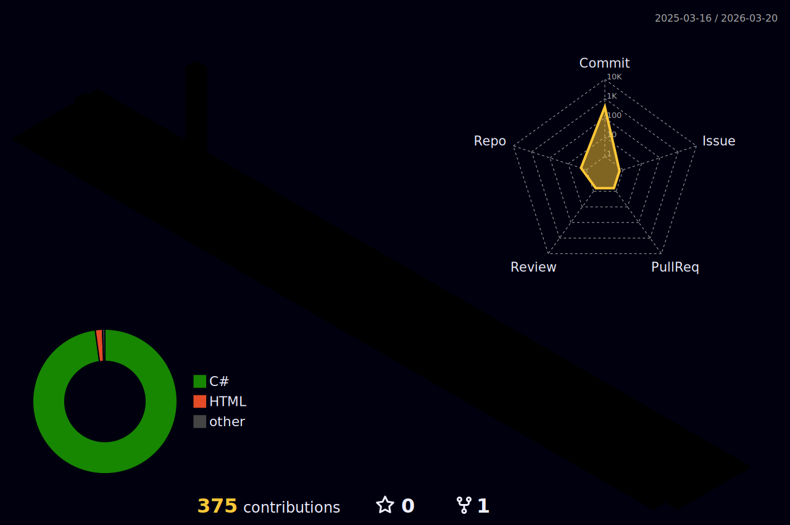

 <div align=center>
  <h3>🍀SKIIL</h3><br>
 
 
 
 
 
 <br>
 
 
  
<br>
<br>
<br>

  <H1>⚠️INTRODUCTION⚠️ </H1>
  
  
 </div>

📁PROFILE📁 
## 이름 : 안승찬 👨‍💼
## 주소 : 수원시 거주 🏘️
## 연락처 : 010-3562-0273 📱
* 이메일 : asc001062@naver.com 📧
* 생년월일 : 2000년 10월 10일 🎂

```c
int year = 25;
printf("이름은 안승찬")
printf("나이는 %d 입니다",year)
```

*아직 개발 실력이 많이 부족합니다
* 예쁘게 봐주세용
* 저는 게임 개발을 합니다.
* tmi : 내 생년월일 6자리를 2잔수라 할때 10진수로 바꿔도 10이다


<h1>Project</h1>
건강 케어 서비스 : "알약을 알려드림"
</img>

* 알약 검색 기능 : 정보를 찾고 싶은 약의 사진을 찍어 정보를 찾아 준다.
* 건강 트레이너 : 사용자의 건강을 관리를 해준다.
* 혈압 혈당 체크 : 혈압과 혈당을 체크를 해주는 앱이다.
* 약사 온라인 상담 : 약사와 1대1 채팅을 매칭하여 온라인으로 상담한다.

<h2>Cleaningday_BETA<h2>
ㆍㆍㆍ개발중ㆍㆍㆍ
<h3>취미 생활</h3>

### 🌱 옥상에 작은 텃밭을 관리한다.
### 😄 친구들과 함께 카페가는걸 좋아한다.


⭐⭐⭐⭐⭐⭐⭐
github 방문 횟수


<!--
**asc001010/asc001010** is a ✨ _special_ ✨ repository because its `README.md` (this file) appears on your GitHub profile.

Here are some ideas to get you started:

- 🔭 I’m currently working on ...
- 🌱 I’m currently learning ...
- 👯 I’m looking to collaborate on ...
- 🤔 I’m looking for help with ...
- 💬 Ask me about ...
- 📫 How to reach me: ...
- 😄 Pronouns: ...
- ⚡ Fun fact: ...
-->
