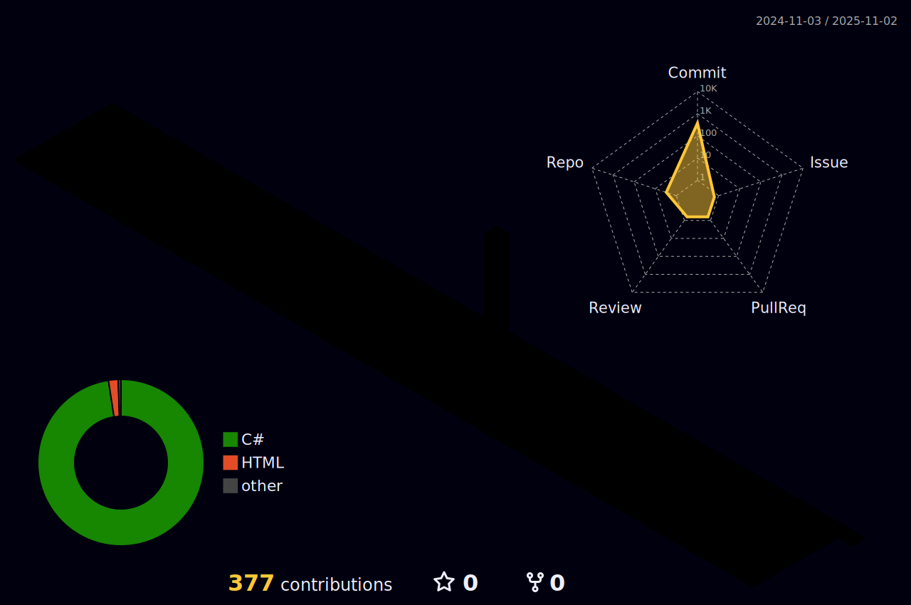

 

  <h3>🍀SKIIL</h3> 
 
 
 
 
 
  
 
 
  
 
 
 

  <H1>⚠️INTRODUCTION⚠️ </H1>
  
  
 

📁PROFILE📁 
## 이름 : 안승찬 👨‍💼
## 주소 : 수원시 거주 🏘️
## 연락처 : 010-3562-0273 📱
* 이메일 : asc001062@naver.com 📧
* 생년월일 : 2000년 10월 10일 🎂

* tmi : 내 생년월일 6자리를 2잔수라 할때 10진수로 바꿔도 10이다

<h1>Project</h1>
건강 케어 서비스 : "알약을 알려드림"
</img>

* 알약 검색 기능 : 정보를 찾고 싶은 약의 사진을 찍어 정보를 찾아 준다.
* 건강 트레이너 : 사용자의 건강을 관리를 해준다.
* 혈압 혈당 체크 : 혈압과 혈당을 체크를 해주는 앱이다.
* 약사 온라인 상담 : 약사와 1대1 채팅을 매칭하여 온라인으로 상담한다.

<h2>하루 배차</h2>
배차를 연결하는 게 아니라, 배차를 판단해주는 AI 서비스
 
① 배차별 예상 실수입 계산
*	•	운임
*	•	예상 공차 이동 거리
*	•	대기시간
*	•	다음 일정 연계 가능성
 
*② 배차 간 수익 비교
*	•	배차 A vs 배차 B
*	•	하루 기준 누적 예상 수익 비교
 
*③ 오늘 기준 최적 배차 추천
*	•	현재 위치
*	•	남은 시간
*	•	기사 개인 선호(거리/시간)
 
*④ 하루 수익 시뮬레이션
*	•	지금 선택에 따라
*	•	하루 종료 시 예상 총 수입 표시
 
<h3>취미 생활</h3>

### 🌱 옥상에 작은 텃밭을 관리한다.
### 😄 친구들과 함께 카페가는걸 좋아한다.

⭐⭐⭐⭐⭐⭐⭐
github 방문 횟수

<!--
**asc001010/asc001010** is a ✨ _special_ ✨ repository because its `README.md` (this file) appears on your GitHub profile.

Here are some ideas to get you started:

- 🔭 I’m currently working on ...
- 🌱 I’m currently learning ...
- 👯 I’m looking to collaborate on ...
- 🤔 I’m looking for help with ...
- 💬 Ask me about ...
- 📫 How to reach me: ...
- 😄 Pronouns: ...
- ⚡ Fun fact: ...
-->
