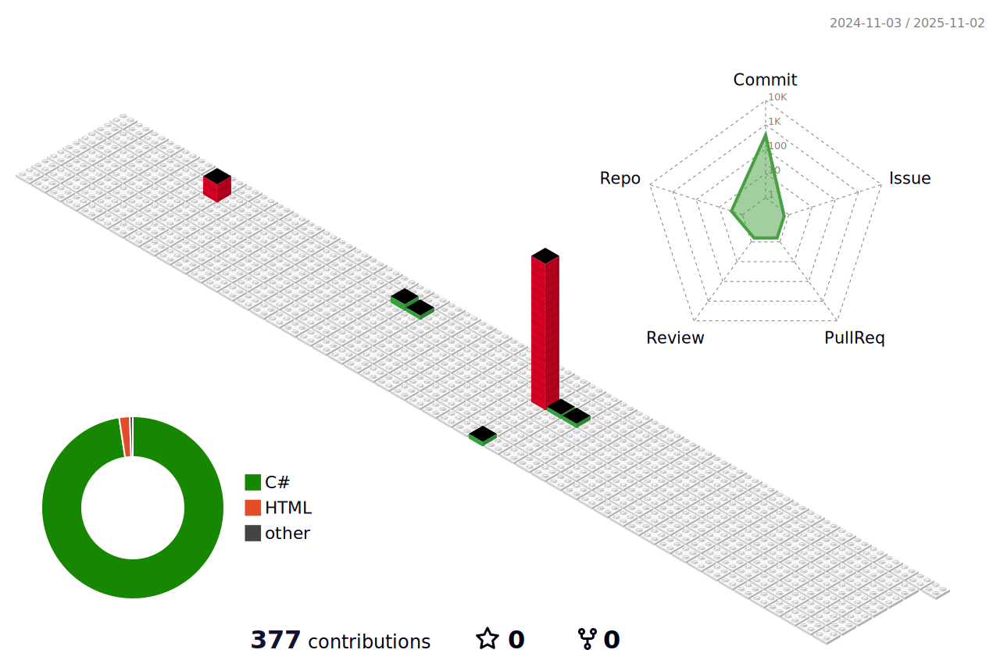

#  안승찬의 프로파일
## 이름 : 안승찬
## 주소 : 한림대학교
## 연락처 : 010-3562-0273
* 이메일 : asc001062@naver.com
* 생년월일 : 2000년 10월 10일

```c
int year = 25;
printf("이름은 안승찬")
printf("나이는 %d 입니다",year)
```

*아직 개발 실력이 많이 부족합니다
* 예쁘게 봐주세용
* 저는 게임 개발을 합니다.
* tmi : 내 생년월일 6자리를 2잔수라 할때 10진수로 바꿔도 10이다


- - -


<h1>현재 개발 프로젝트</h1>

<h3>건강 케어 서비스 : "알약을 알려드림"</h3>
</img>

* 알약 검색 기능 : 정보를 찾고 싶은 약의 사진을 찍어 정보를 찾아 준다.
* 건강 트레이너 : 사용자의 건강을 관리를 해준다.
* 혈압 혈당 체크 : 혈압과 혈당을 체크를 해주는 앱이다.
* 약사 온라인 상담 : 약사와 1대1 채팅을 매칭하여 온라인으로 상담한다.

<h2> 서공제 준비</h2>

<h3>할로윈 디펜스 게임</h3>
</img>

* 주요기능
  * 포탑 타워 디펜스 게임
  * 포탑을 Player 가 수리 할 수 잇다
  * 적에게 자신의 성을 지켜 나가는 게임

- - -
<h3>취미 생활</h3>

### 🌱 옥상에 작은 텃밭을 관리한다.
### 😄 친구들과 함께 카페가는걸 좋아한다.
- - -
<h4>게임 개발에 관심 있거나 프로젝트 같이 해보고 싶은 분 연락 주세요 !!!<h4>



<!--
**asc001010/asc001010** is a ✨ _special_ ✨ repository because its `README.md` (this file) appears on your GitHub profile.

Here are some ideas to get you started:

- 🔭 I’m currently working on ...
- 🌱 I’m currently learning ...
- 👯 I’m looking to collaborate on ...
- 🤔 I’m looking for help with ...
- 💬 Ask me about ...
- 📫 How to reach me: ...
- 😄 Pronouns: ...
- ⚡ Fun fact: ...
-->
